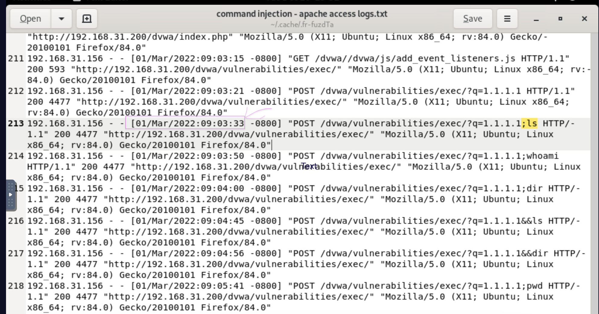

# Detecting-Command-Injection-Attacks

I completed the Command Injection Attacks Lab on LetsDefend . This is what I explored and learned during the Lab:

✅ What Command Injection Attacks are

✅ How Command Injection works

✅ How attackers can exploit Command Injection attacks

✅ How to prevent Command Injection attacks

✅ How to detect Command Injection attacks

## Finding the Answer to Question 1

## Question 1 Correct Answer

## Finding the Answer to Question 2

## Question 2 Correct Answer

## Finding the Answer to Question 3

## Question 3 Correct Answer

